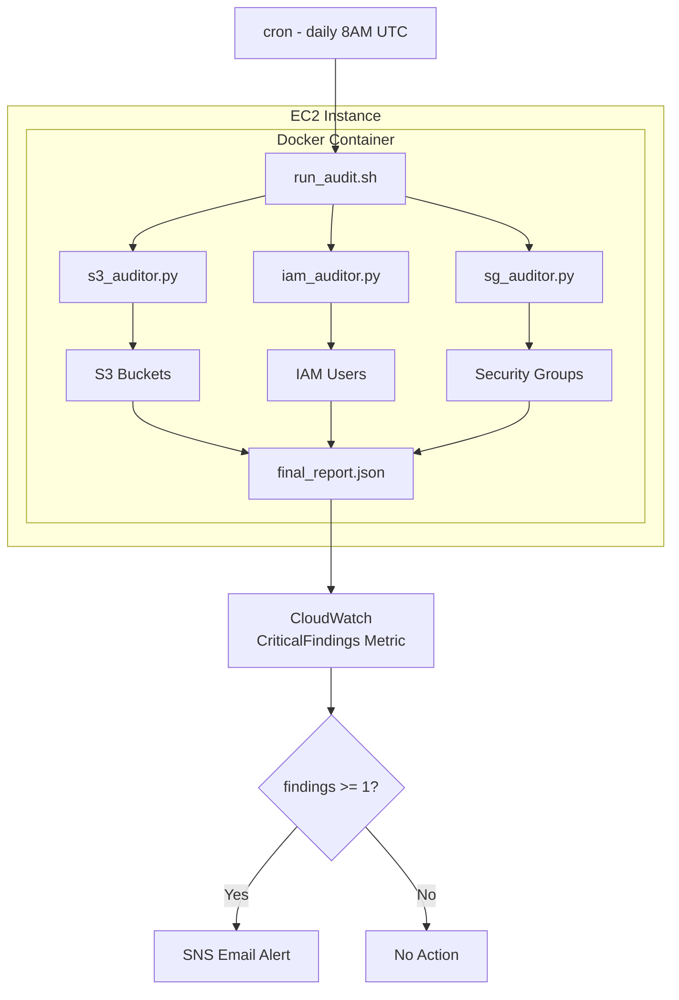

# AWS Security Auditor

An automated AWS cloud security auditing tool that scans an AWS account for common misconfigurations and generates a detailed security report. Built with Python (boto3), Bash, and Docker. Deployed on AWS EC2 with CloudWatch alerting and cron scheduling.

---

## Architecture

## Architecture



---

## What It Detects

### S3 Bucket Auditor
- Buckets with public ACLs or public bucket policies
- Block Public Access not fully enabled
- Encryption (SSE) not configured
- Versioning disabled

### IAM Auditor
- IAM users with no MFA enabled
- Users with Administrator privileges
- Inactive users (no login in 90+ days)
- Stale or multiple active access keys

### Security Group Auditor
- SSH (port 22) open to 0.0.0.0/0
- RDP (port 3389) open to 0.0.0.0/0
- All traffic open to the internet
- Any port exposed to public CIDRs

---

## Severity Levels

| Severity | Meaning |
|----------|---------|
| CRITICAL | Active exposure — immediate action required |
| HIGH | Misconfiguration that could lead to exposure |
| MEDIUM | Best practice violation |
| OK | No issues found |

---

## Tech Stack

- **Python 3.12** — audit logic (boto3)
- **Bash** — orchestration wrapper
- **Docker** — containerized deployment
- **AWS EC2** — hosting and execution
- **AWS IAM** — least privilege role for the auditor
- **AWS CloudWatch** — custom metrics and alerting
- **AWS SNS** — email notifications on critical findings
- **GitHub** — version control

---

## Project Structure

aws-security-auditor/
├── auditors/
│   ├── s3_auditor.py       # S3 bucket misconfiguration scanner
│   ├── iam_auditor.py      # IAM user security scanner
│   └── sg_auditor.py       # Security group scanner
├── reports/                # Generated JSON reports (gitignored)
├── Dockerfile              # Container definition
├── run_audit.sh            # Bash wrapper — runs all auditors
└── README.md

---

## Sample Report Output

```json
{
  "audit_type": "FULL_AUDIT",
  "timestamp": "2026-05-28T21:48:48+00:00",
  "total_critical": 1,
  "audits": {
    "s3": {
      "summary": {
        "total_buckets": 3,
        "critical": 1,
        "high": 0,
        "medium": 2,
        "ok": 0
      }
    },
    "iam": {
      "summary": {
        "total_users": 2,
        "critical": 0,
        "high": 0,
        "medium": 1,
        "ok": 1,
        "no_mfa": 0,
        "admins": 1,
        "inactive": 0
      }
    },
    "security_groups": {
      "summary": {
        "total_security_groups": 1,
        "critical": 0,
        "high": 0,
        "ok": 1,
        "ssh_open": 0,
        "rdp_open": 0,
        "all_traffic_open": 0
      }
    }
  }
}
```

---

## Setup and Usage

### Prerequisites
- AWS account with IAM role attached to EC2 (`AWSSecurityAuditorRole`)
- Docker installed
- Git installed

### Local Setup

```bash
# Clone the repo
git clone https://github.com/s-kilaparthi/aws-security-auditor.git
cd aws-security-auditor

# Install dependencies
pip3 install boto3

# Configure AWS credentials
aws configure

# Run individual auditors
python3 auditors/s3_auditor.py
python3 auditors/iam_auditor.py
python3 auditors/sg_auditor.py

# Run full audit
bash run_audit.sh
```

### Docker Setup (Recommended)

```bash
# Build image
docker build -t aws-security-auditor .

# Run full audit
docker run --rm \
  -e AWS_DEFAULT_REGION=us-east-1 \
  -v $(pwd)/reports:/app/reports \
  aws-security-auditor
```

### EC2 Deployment

```bash
# SSH into EC2
ssh -i your-key.pem ubuntu@YOUR_EC2_IP

# Clone and run
git clone https://github.com/s-kilaparthi/aws-security-auditor.git
cd aws-security-auditor
docker build -t aws-security-auditor .
docker run --rm -e AWS_DEFAULT_REGION=us-east-1 \
  -v $(pwd)/reports:/app/reports aws-security-auditor
```

### Schedule with Cron (Daily at 8AM UTC)

```bash
crontab -e
# Add this line:
0 8 * * * cd /home/ubuntu/aws-security-auditor && docker run --rm -e AWS_DEFAULT_REGION=us-east-1 -v /home/ubuntu/aws-security-auditor/reports:/app/reports aws-security-auditor >> /home/ubuntu/aws-security-auditor/reports/cron.log 2>&1
```

---

## IAM Permissions Required

```json
{
  "Version": "2012-10-17",
  "Statement": [
    {
      "Effect": "Allow",
      "Action": [
        "iam:ListUsers",
        "iam:ListMFADevices",
        "iam:ListAttachedUserPolicies",
        "iam:ListGroupsForUser",
        "iam:ListAttachedGroupPolicies",
        "iam:GetUser",
        "iam:ListAccessKeys",
        "iam:GetAccessKeyLastUsed",
        "s3:ListAllMyBuckets",
        "s3:GetBucketPublicAccessBlock",
        "s3:GetBucketAcl",
        "s3:GetBucketPolicy",
        "s3:GetEncryptionConfiguration",
        "s3:GetBucketVersioning",
        "ec2:DescribeSecurityGroups",
        "cloudwatch:PutMetricData"
      ],
      "Resource": "*"
    }
  ]
}
```

---

## Author

**Siva Karthik Kilaparthi**
MS in Computer and Information Science — Texas A&M University Corpus Christi (Dec 2025)
[GitHub](https://github.com/s-kilaparthi) | [LinkedIn](https://linkedin.com/in/siva-karthik-kilaparthi/)
